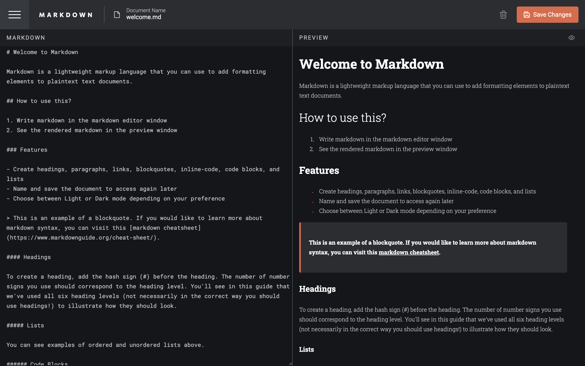
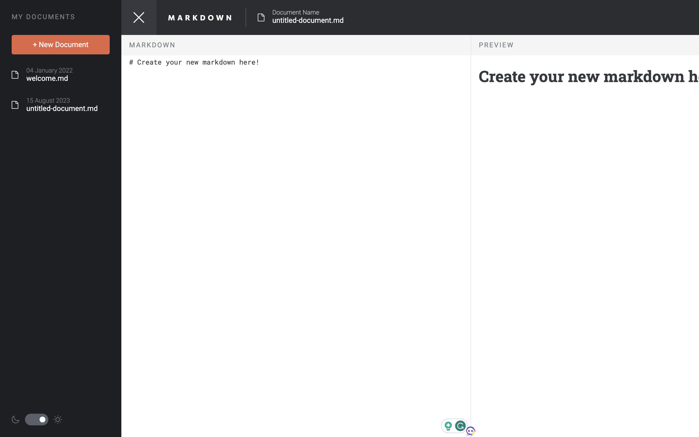
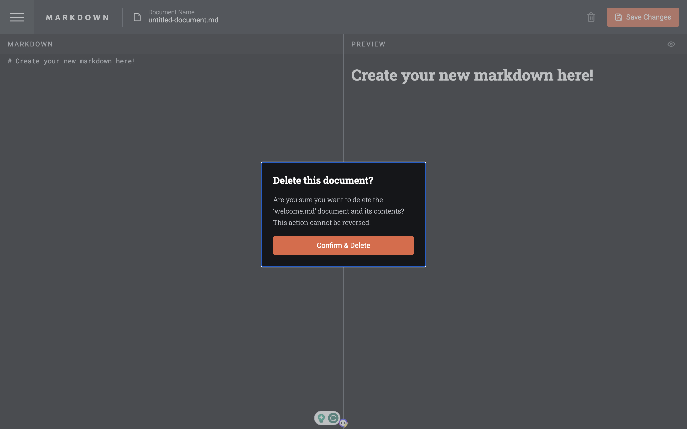

<h1 align="center">Markdown Editor 𝌡</h1>

A powerful Markdown Editor, an online platform that interprets Markdown language and displays the results in real-time. Edit and preview your content seamlessly with an intuitive interface. Experience the convenience of effortless Markdown editing and unleash your creativity!"

  
  

Click [here](https://markdown-editor-rajeev.vercel.app/) and simplify your tasks with Kanban Task Manager.

## Features and Interfaces

- Multiple Boards: Create and manage multiple boards for tasks.

- Customizable Board: Fully customizable board to simplify tasks.

- Easy Task Tracking: Effortlessly track progress by swiping tasks.

- Add New Columns: Add columns to tailor the tool to your workflow.

- Hide Slider: Hide slider for clutter-free workspace.

- Dark and Light Modes: Work in any environment with both modes available.

- Quick Add Button: One-click button to quickly add new tasks.

## Tech stack

- React.Js
- JavaScript
- Markdown-to-JSX
- React-DOM
- User Events
- User Events
- Styled Components

## Points to remember while testing the WebApp

1. First of all fork this [repository](https://github.com/Rajeevjewar/Kanban-Task-Management.git) and clone it.
2. Install all the dependencies using `npm install` command.
3. Run the app using `npm start` command.
4. When testing on android emulator, if you get a connection error use `http://localhost:3000/`
5. The app is now running, Now you can test the WebApp.

## Useful Links

- [Project Demo](https://markdown-editor-rajeev.vercel.app/) for Web version

- [Project Repository](https://github.com/Rajeevjewar/Kanban-Task-Management.git)

## Need help?

Feel free to contact me on [Twitter](https://twitter.com/be_rajeevkumar) or [LinkedIn](https://www.linkedin.com/in/berajeevkumar/), know more about me at [iamrajeev.me](https://iamrajeev.me)

<h1 align=center>Happy Coding 👨‍💻</h1>

Show some ❤️&nbsp; by giving the star to this repo

